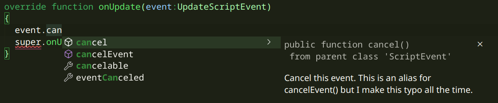
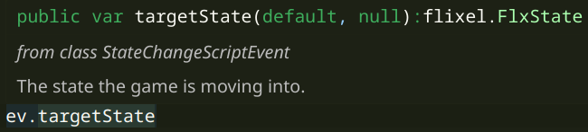
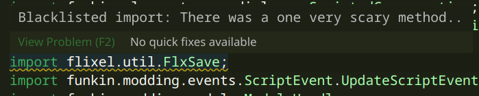
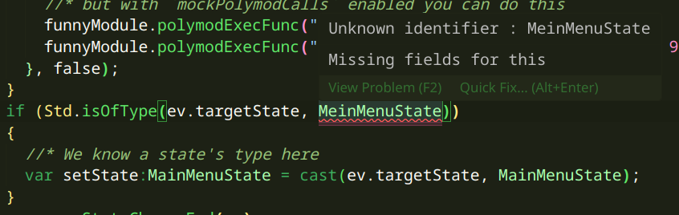

<!-- PROJECT LOGO -->
<br />
<div align="center">
  <a href="https://github.com/FunkinCompiler/funkin-extension">
    
  </a>

<h3 align="center">Funkin Compiler</h3>

  <p align="center">
    A simple extension to both develop and compile V-Slice mods in a more comfortable environment than a notepad.
    <br />
    <br />
    ·
    <a href="https://github.com/FunkinCompiler/funkin-extension/issues">Report Bug or Request Feature</a>
    ·
    <a href="https://github.com/FunkinCompiler/funkin-extension/pulls">Create Pull Request</a>
  </p>
</div>

It's more or less implementation of [this](https://github.com/FunkinCrew/Funkin/issues/5199) suggestion.

<h2 align="center">This extension is still in beta</h2>

# Features (as of now)

### Schema hints for .json files


### Automatic .fnfc extraction
You can put your chars into a special ``fnfc_files`` folder and they'll be automatically included with your mod when compiled.
### Nearly all features of haxe's autocompletion server, including:
  - #### Code autocompletion
    
  - #### Code formatting
    Lets you format your haxe code using `Ctr + Alt + L` shortcut. 
  - #### Type hints
    
  - #### Blacklist detection
    
  - #### Static error checking
    
  - #### "Go to definition" function with Ctr+ click on function/class
    You can click with Ctr key on a field to go to it's definition.
    Works for both Haxe and FNF classes. 
### All TTW compiler features
  - #### Casting objects 
    If you know the exact type of a generic variable (like the type of state from ev.targetState) you may cast it using `cast (<field>,<type>)` eg. `cast (ev.targetState,OptionsState)`.
    > **DO NOT USE** `cast <field>` (`cast ev.targetState`)

  - #### Fixing imports 

    Attempts to fix Polymod issues with importing nested types:

    This means that:
    - *import funkin.modding.events.**ScriptEvent**.StateChangeScriptEvent;*
     
     turns into
    - *import funkin.modding.events.StateChangeScriptEvent;*

  - #### Module.scriptCall() fix 

    Allows you to use a documented `Module.polymodExecFunc()` function instead of the missing one.
    It will be converted to the `Module.scriptCall()` once compiled.

## How to Install

1. Install both Haxe and Git
3. Install the extension.
4. Run `Funkin compiler: Setup haxelib` command to install necessary dependencies (You will be asked to select a folder to install haxelibs into).
5. Once done, open a new **empty** folder
6. Run `Funkin compiler: Make new project` to scaffold template for your mod.
7. Once done, you can customise some settings from ``funk.cfg`` file.
> Note: filepaths are based on your project's root dorectory
 - ``mod_content_folder`` Points to your mod's base folder.
 All the files here will copied first when compiling your mod.
 - ``mod_hx_folder`` Point to your code managed, and then compiled by the program.
 This is where you write your code.
 - ``mod_fnfc_folder`` Points to the FNFC files of your mod.
 Those get properly integrated into your mod when compiling.
 This lets you easily edit the songs from the game itself.

## How to migrate
#### from 0.3.0 - 0.3.2 

If you get the "Startup warning" about Funkin compiler not being configured correctly:
- Click ``Yes``
- Select folder you chose when running the `Funkin: Setup Funkin compiler` command
- Click ``Cancel`` when asked about non-clean haxelib folder.
## How to use

#### Making a new project

To create a new project, run the `Funkin compiler: Make new project` command in a empty folder.

#### Customising the extension
The extension adds the new task type: ``funk``,
new debugger type ``funkin-run-game``


and the following settings (apply as default settings for the compile task):
 - ``funkinCompiler.modName`` Is the name of your mod in the game instance
 available from the "mods" folder.
 - ``funkinCompiler.gamePath`` Path to the game folder.
 - ``funkinCompiler.haxelibPath`` Path to your haxelib folder. This should be set when running the `Funkin compiler: Setup haxelib` command.

#### Working on the project
- Open the newly created project in VSCode or a fork based on it.
- Head over to the extensions tab and install all of the recommended extensions.

- Run ```Funkin compiler: Set haxelib``` to set Funkin Compiler's haxelib folder. 
- Initialise a new git repo and add at least one commit and add all files to it (I recommend to use VSCode for that)

[Here is a TTW file documenting the project's structure](./assets/scaffold/GETTING_STARED.md)

## How to compile

Mase sure to install both `vscode` and `vscode-debugadapter` haxelibs.

As for node, run `npm install vscode-debugadapter` to install dependencies for the debugger.

#### Not asossiated with "Funkin' Crew" btw.
