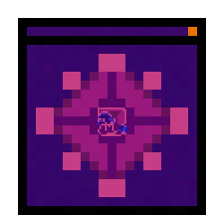

<!-- PROJECT LOGO -->
 

  

<h3 align="center">Funkin Compiler</h3>

  

    A simple extension to both develop and compile V-Slice mods in a more comfortable environment than a notepad.
     
     
    ·
    <a href="https://github.com/FunkinCompiler/funkin-extension/issues">Report Bug or Request Feature</a>
    ·
    <a href="https://github.com/FunkinCompiler/funkin-extension/pulls">Create Pull Request</a>
  

<h2 align="center">This extension is still in beta</h2>

## How to Install

1. Install both Haxe and Git
2. Use ``haxelib setup`` to create an empty repo for dependencies.
3. Install the extension.
4. Run `Funkin: Setup Funkin compiler` command to install necessary dependencies.
5. Once done, open a new **empty** folder
6. Run `Funkin: Make new project` to scaffold template for your mod.
7. Once done, you can customise some settings from ``funk.cfg`` file.
> Note: filepaths are based on your project's root dorectory
 - ``mod_content_folder`` Points to your mod's base folder. 
 All the files here will copied first when compiling your mod.
 - ``mod_hx_folder`` Point to your code managed, and then compiled by the program.
 This is where you write your code.
 - ``mod_fnfc_folder`` Points to the FNFC files of your mod. 
 Those get properly integrated into your mod when compiling.
 This lets you easily edit the songs from the game itself.

## How to use

#### Making a new project

To create a new project, run the `Funkin: Make new project` command in a empty folder. 

#### Customising the extension
The extension adds the new task type: ``funk``,
new debugger type ``funkin-run-game``

and the following settings (apply as default settings for the compile task):
 - ``funkinCompiler.modName`` Is the name of your mod in the game instance
 available from the "mods" folder.
 - ``funkinCompiler.gamePath`` Path to the game folder.

#### Working on the project

- Open the newly created project in VSCode or a fork based on it. 
- Head over to the extensions tab and install all of the recommended extensions.

- Initialise a new git repo and add at least one commit and add all files to it (I recommend to use VSCode for that)

Be sure to either restart VSCode or reload the window for the changes to take effect. After that you should be ready to go!
[Here is a TTW file documenting the project's structure](./GETTING_STARED.md)

## How to compile

Mase sure to install both `vscode` and `vscode-debugadapter` haxelibs.

As for node, run `npm install vscode-debugadapter` to install dependencies for the debugger.

#### Not asossiated "Funkin' Crew" btw.