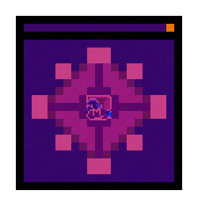
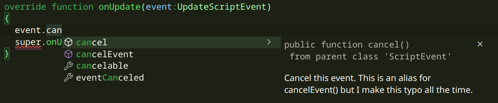
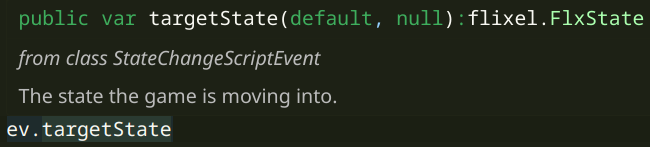
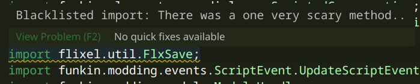
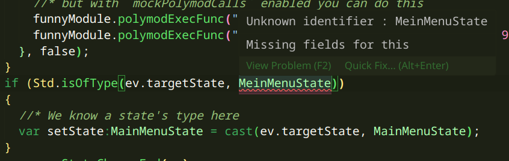

<!-- PROJECT LOGO -->
<br />
<div align="center">
  <a href="https://github.com/FunkinCompiler/funkin-extension">
    
  </a>

<h3 align="center">Funkin Compiler</h3>

  <p align="center">
    A simple extension to both develop and compile V-Slice mods in a more comfortable environment than a notepad.
    <br />
    <br />
    ·
    <a href="https://github.com/FunkinCompiler/funkin-extension/issues">Report Bug or Request Feature</a>
    ·
    <a href="https://github.com/FunkinCompiler/funkin-extension/pulls">Create Pull Request</a>
  </p>
</div>

#### It's more or less implementation of [this](https://github.com/FunkinCrew/Funkin/issues/5199) suggestion.

<h2 align="center">This extension is still in beta</h2>

### Funkin Compiler can work in multiple "modes"
- #### As a framework for the project of your V-Slice mod (mode 1)

  This mode is recommended if you want to create **new** mods to Friday Night Funkin. It's the most complete one!
- #### As an editor to existing V-Slice mods (mode 2)

  Opening such mod will allow you to either make quick edits more easily, or develop your existing mod (If you decide against migrating it to a project)

  As no code pre-processing is done here, some suggestions given by haxe might be wrong, so watch out!
- #### As an tool to contribute the the Friday Night Funkin "assets" repository (mode 3)

  If you feel like contributing your time to the development of the game, opening "assets" folder with this extension will provide you with the same tooling as if you were making a mod.

  As no code pre-processing is done here, some suggestions given by haxe might be wrong.
# Features (as of now)

### Schema hints for .json files


### Nearly all features of haxe's autocompletion server, including:
  - #### Code autocompletion
    
  - #### Code formatting
    Lets you format your haxe code using `Ctr + Alt + L` shortcut. 
  - #### Type hints
    
  - #### Blacklist detection
    
  - #### Static error checking
    
  - #### "Go to definition" function with Ctr+ click on function/class
    You can click with Ctr key on a field to go to it's definition.
    Works for both Haxe and FNF classes. 

  - #### Casting objects (mode 1)
    If you know the exact type of a generic variable (like the type of state from ev.targetState) you may cast it using `cast (<field>,<type>)` eg. `cast (ev.targetState,OptionsState)`.
    > **DO NOT USE** `cast <field>` (`cast ev.targetState`)

  - #### Fixing imports (mode 1)

    Attempts to fix Polymod issues with importing nested types:

    This means that:
    - *import funkin.modding.events.**ScriptEvent**.StateChangeScriptEvent;*
     
     turns into
    - *import funkin.modding.events.StateChangeScriptEvent;*

  - #### Module.scriptCall() fix (mode 1)

    Allows you to use a documented `Module.polymodExecFunc()` function instead of the missing one.
    It will be converted to the `Module.scriptCall()` once compiled.

### Automatic .fnfc extraction (mode 1)
You can put your chars into a special ``fnfc_files`` folder and they'll be automatically included with your mod when compiled.

## How to Install

1. Install [Haxe](https://haxe.org/download/)
3. Install this extension.
4. Run `Funkin compiler: Setup haxelib` command to install necessary dependencies (You will be asked to select a folder to install haxelibs into).

### For mode 1 (Funkin Compiler projects)

5. Run `Funkin compiler: Make new project` to scaffold template for your mod.
6. Once done, you can customise some settings from ``funk.cfg`` file.
> Note: filepaths are based on your project's root dorectory
 - ``mod_content_folder`` Points to your mod's base folder.
 All the files here will copied first when compiling your mod.
 - ``mod_hx_folder`` Point to your code managed, and then compiled by the program.
 This is where you write your code.
 - ``mod_fnfc_folder`` Points to the FNFC files of your mod.
 Those get properly integrated into your mod when compiling.
 This lets you easily edit the songs from the game itself.

### For mode 2 (V-Slice mods)

Just launch any V-Slice mod directory. There should be a special message about activation of this mode.

**NOTE: You need to apply a patch to haxe extension first.**

Don't worry, opening any ".hxc" file will prompt you to do so.

### For mode 3 (FNF assets folder)

Same as mode 2, but instead of V-Slice mod open the "assets" folder in the FNF code repository with your IDE.

## How to migrate
#### from 0.3.0 - 0.3.2 

If you get the "Startup warning" about Funkin compiler not being configured correctly:
- Click ``Yes``
- Select folder you chose when running the `Funkin: Setup Funkin compiler` command
- Click ``Cancel`` when asked about non-clean haxelib folder.
## How to use

#### Making a new project (mode 1)

To create a new project, run the `Funkin compiler: Make new project` command in a empty folder.

#### Customising the extension
The extension adds the new task type: ``funk``,
new debugger type ``funkin-run-game``


and the following settings (apply as default settings for the compile task):
 - ``funkinCompiler.modName`` Is the name of your mod in the game instance
 available from the "mods" folder.
 - ``funkinCompiler.gamePath`` Path to the game folder.
 - ``funkinCompiler.haxelibPath`` Path to your haxelib folder. This should be set when running the `Funkin compiler: Setup haxelib` command.

#### Working on the project
- Open the newly created project in VSCode or a fork based on it.
- Head over to the extensions tab and install all of the recommended extensions.

- Run ```Funkin compiler: Set haxelib``` to set Funkin Compiler's haxelib folder. 
- Initialise a new git repo and add at least one commit and add all files to it (I recommend to use VSCode for that)

[Here is a TTW file documenting the project's structure](./assets/scaffold/GETTING_STARED.md)

## How to compile

Mase sure to install both `vscode` and `vscode-debugadapter` haxelibs.

As for node, run `npm install vscode-debugadapter` to install dependencies for the debugger.

#### Not asossiated with "Funkin' Crew" btw.
